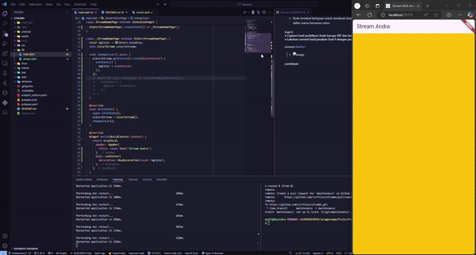

<h1 align="center">Stream Flutter</h1>
<p align="center">Praktikum Perkuliahan</p>

## about

> Name : MUH ANDRA ARIESFI<br/>
> Nim : 362358302103<br/>
> Kelas : 2D TRPL

## clone

```bash
git clone https://github.com/zzrftixx/streams_andra.git
cd streams_andra
```

```bash
flutter run
```

## soal

<div>
    <h2 align="left">Soal 1</h2>
    <h5 align="left">
        <br>
        ● Tambahkan nama panggilan Anda pada title app sebagai identitas hasil pekerjaan Anda.
        <br>
        ● Gantilah warna tema aplikasi sesuai kesukaan Anda.
        <br>
        ● Lakukan commit hasil jawaban Soal 1 dengan pesan “W13: Jawaban Soal 1”
        <br>
    </h5>

<p align="left">
answare
  <a href="https://github.com/zzrftixx">Andra</a> •
<br>

- finish

</p>
</div>

<div>
    <h2 align="left">Soal 2</h2>
    <h5 align="left">
        <br>
        ● Tambahkan 5 warna lainnya sesuai keinginan Anda pada variabel colors tersebut.
        <br>
        ● Lakukan commit hasil jawaban Soal 2 dengan pesan “W13: Jawaban Soal 2”
    </h5>

<p align="left">
answare
  <a href="https://github.com/zzrftixx">Andra</a> •
<br>

- finish

</p>
</div>

<div>
    <h2 align="left">Soal 3</h2>
    <h5 align="left">
        <br>
        ● Jelaskan fungsi keyword yield* pada kode tersebut!
        <br>
        ● Apa maksud isi perintah kode tersebut?
        <br>
        ● Lakukan commit hasil jawaban Soal 3 dengan pesan “W13: Jawaban Soal 3”
    </h5>

<p align="left">
answare
  <a href="https://github.com/zzrftixx">Andra</a> •
<br>

- fungsi yield\* Digunakan untuk mem-forward (meneruskan) semua elemen dari stream lain ke stream yang sedang dihasilkan.

- Alih-alih memanggil yield berulang kali untuk setiap elemen stream yang diteruskan, yield\* memungkinkan integrasi seluruh stream sekaligus.

- Kode tersebut bertujuan untuk membuat stream warna (Stream<Color>) yang menghasilkan elemen warna secara berulang-ulang dari daftar warna bernama colors.
</p>
</div>

<div>
    <h2 align="left">Soal 4</h2>
    <h5 align="left">
        <br>
        ● Capture hasil praktikum Anda berupa GIF dan lampirkan di README
        <br>
        ● Lakukan commit hasil jawaban Soal 4 dengan pesan “W13: Jawaban Soal 4”
    </h5>
<p align="left">
answare
  <a href="https://github.com/zzrftixx">Andra</a> •
<br>

- 

<br>
</p>
</div>

<div>
    <h2 align="left">Soal 5</h2>
    <h5 align="left">
        <br>
        ● Jelaskan perbedaan menggunakan listen dan await for (langkah 9) !
        <br>
        ● Lakukan commit hasil jawaban Soal 5 dengan pesan “W13: Jawaban Soal 5”
    </h5>
<p align="left">
answare
  <a href="https://github.com/zzrftixx">Andra</a> •
  <br>

Listen

    Berlangganan: listen digunakan untuk berlangganan pada suatu stream (aliran data). Ketika ada data baru yang masuk ke stream, listener (fungsi yang kita berikan ke listen) akan dipanggil secara otomatis.
    Berjalan secara asinkron: Proses mendengarkan ini berjalan di latar belakang, tidak menghentikan eksekusi kode utama.
    Multiple data: Kita bisa menerima banyak data dari stream secara berurutan.
    Contoh penggunaan: Mendengarkan perubahan pada suatu variabel, mendengarkan data yang datang dari WebSocket, atau mendengarkan event dari suatu widget.

await for

    Menunggu hasil: await for digunakan untuk menunggu hasil dari sebuah future yang mengembalikan stream.
    Sinkronisasi: Eksekusi kode akan berhenti sampai data pertama dari stream diterima.
    Satu data: Biasanya digunakan untuk mengambil satu data dari stream.
    Contoh penggunaan: Mengambil data dari API yang mengembalikan stream, membaca data dari file secara berurutan.

<br>

</p>
</div>

## contribute

<h4 align="center">contribute? only me</h4>
<p align="center">
  <a href="https://github.com/zzrftixx">Andra</a> •
  <a href="https://github.com/zzrftixx">Andra</a> •
  <a href="https://github.com/zzrftixx">Andra</a> •
  <a href="https://github.com/zzrftixx">Andra</a> •
</p>
